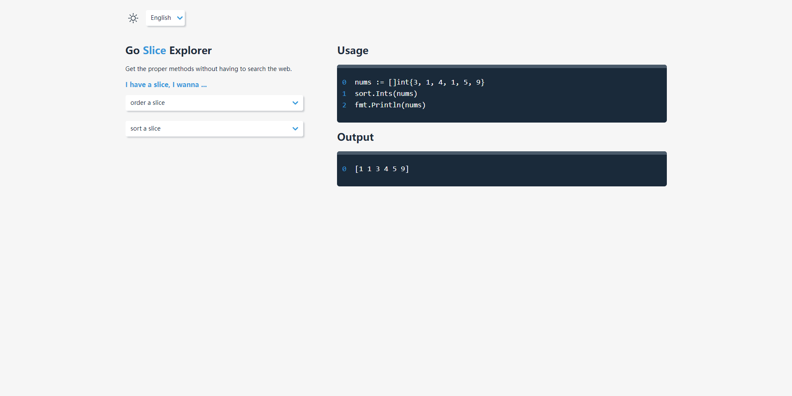

# go-slice-explorer

Get the proper code snippets for Golang slice without having to search the web :-)

This project is inspired by [git-explorer](https://github.com/summitech/gitexplorer) and [array-explorer](https://github.com/sdras/array-explorer)

Tech stack: `Vite + React + styled-components + zustand`

Check [here](https://go-slice-explorer.icarmine.com/) or [here](https://go-slice-explorer.vercel.app/) to see the project in action



## Project Setup

local development:
```bash
pnpm install
pnpm dev
```
build:
```bash
pnpm build
```
